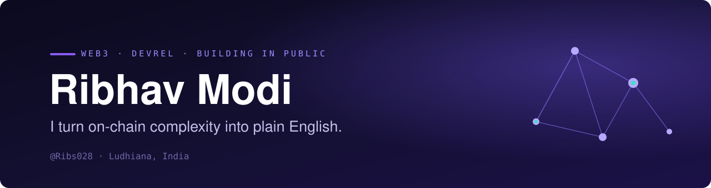

<!-- Ribs028/Ribs028 profile README. Keep assets/banner.svg in the repo. -->

  

  

  
  
  
  
  

 

### Web3 technical writer & developer-educator

I write the article I wish I'd found when I was new to Web3: no jargon walls, no hand-waving, just clear explanations of how things actually work on-chain. My lane is **DeFi, on-chain data, GraphQL, wallets, DAOs, and RWAs**, written for the smart person who's new to the space. When I'm not writing, I'm building the systems that let me write faster and reach further.

 

**What I'm focused on right now**

`▹` Writing technical blogs on DeFi and on-chain data, the concepts *and* the actual GraphQL queries 
`▹` Shipping the **60-Day Web3 Series**, daily beginner-friendly explainers across Medium, Substack & Forem 
`▹` Growing **Web3ForHumans**, a community for people learning Web3 out loud (40+ builders and counting) 
`▹` Building AI-powered writing and publishing systems to scale developer education

 

**Latest writing**

<!-- BLOG-POST-LIST:START -->
<!-- BLOG-POST-LIST:END -->

 

**Stack I write about & build with**

  
  
  
  
  
  
  

 

  

 

  <em>Web3 is early. The best way to learn it is to explain it, so I do, every day.</em>

